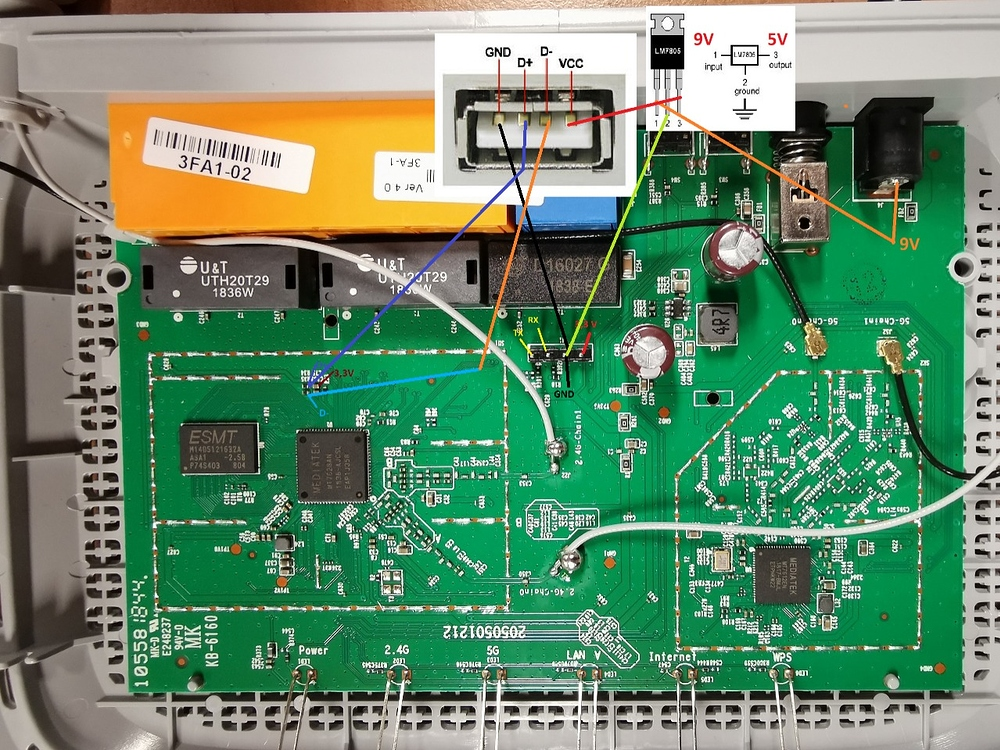

# archer c50v4 usb enabled 22.03 sysupgrade

## hardware mod. ive connected this to a 4port usb hub and it works


## **luci is not enabled so you will need to install it, i did it after mounting usb to /overlay**


## **make sure usb has a ext4 partition. i have both a vfat(sda1) and ext4(sda2) partition(you dont need the vfat partition, my other usb drive broke so im using a temporary one with files on it for now)**

### **install drivers and mount usb to /overlay**

```
#opkg update
```

install required packages
```
# opkg install block-mount kmod-fs-ext4 kmod-usb-storage e2fsprogs kmod-usb-ohci kmod-usb-uhci
```

check that usb is recognized, should look similar to this
```
# dmesg | tail
[   91.701565] usb-storage 1-1.1:1.0: USB Mass Storage device detected
[   91.708962] scsi host2: usb-storage 1-1.1:1.0
[   92.714770] scsi 2:0:0:0: Direct-Access     Kingston DataTraveler 2.0 1.00 PQ: 0 ANSI: 2
[   92.726372] sd 2:0:0:0: [sda] 1994752 512-byte logical blocks: (1.02 GB/974 MiB)
[   92.734814] sd 2:0:0:0: [sda] Write Protect is off
[   92.739691] sd 2:0:0:0: [sda] Mode Sense: 23 00 00 00
[   92.745685] sd 2:0:0:0: [sda] No Caching mode page found
[   92.751147] sd 2:0:0:0: [sda] Assuming drive cache: write through
[   92.851061]  sda: sda1
[   92.858827] sd 2:0:0:0: [sda] Attached SCSI removable disk
```

find partition and UUID of usb. take note of both. if you are using 2partitions like me for whatever reason you can tell by looking for the drive with TYPE="ext4"
```
# block info
/dev/mtdblock4: UUID="0c20cf21-3f5a7273-9a6ad023-80703edd" VERSION="4.0" MOUNT="/rom" TYPE="squashfs"
/dev/mtdblock5: TYPE="jffs2"
/dev/sda1: UUID="586C-4CDB" VERSION="FAT32" TYPE="vfat"
/dev/sda2: UUID="5fb91287-8be9-471c-bca9-dabd13b97103" VERSION="1.0" MOUNT="/overlay" TYPE="ext4"

```

make filesystem(i didnt want to run this again so this code is from elsewhere)
```
# mkfs.ext4 /dev/sda2
mke2fs 1.43.3 (04-Sep-2016)
Creating filesystem with 249088 4k blocks and 62336 inodes
Filesystem UUID: 42109b6a-759a-48ba-a7b9-1508d0973131
Superblock backups stored on blocks:
    32768, 98304, 163840, 229376

Allocating group tables: done
Writing inode tables: done
Creating journal (4096 blocks): done
Writing superblocks and filesystem accounting information: done
```

configure fstab in /etc/config/fstab i used WinSCP for this but you could install nano. put the following code at the bottom, make sure to change the UUID to the one you took note of
```
config 'mount'
        option  target  '/overlay'
        option  uuid    '5fb91287-8be9-471c-bca9-dabd13b97103'
        option  enabled '1'
        option auto_mount '1'
```

mount usb to /mnt
```
# mount /dev/sda2 /mnt
```

copy current /overlay onto usb
```
# cp -a /overlay/. /mnt
```

reboot router
```
# reboot
```

check that usb is being used as overlay
```
# df -h /overlay
Filesystem                Size      Used Available Use% Mounted on
/dev/sda2                 6.1G      5.2M    6G      0%   /overlay
```

## **install luci:**

```
#opkg update
```

```
#opkg install luci luci-ssl
```
